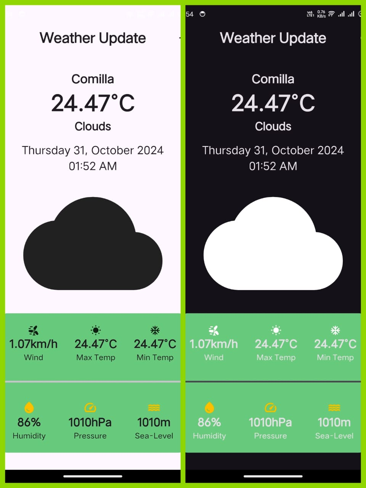

# Weather Update Application

This is a simple and intuitive weather application that provides users with real-time weather updates, supporting both light and dark themes. The app is designed with a minimalistic interface, displaying essential weather details, including temperature, humidity, wind speed, and more. Built with `GetX` for state management and HTTP requests to fetch weather data through a REST API.

## Features

- **Real-time Weather Data**: Get up-to-date information about the weather in your location.
- **Light and Dark Mode Support**: Switch between light and dark themes for comfortable viewing at any time of day.
- **Detailed Weather Stats**: View details like maximum and minimum temperatures, humidity, pressure, sea level, and wind speed.
- **User-Friendly Interface**: A simple and elegant design for easy interaction.

## Screenshot



## Dependencies

- **GetX**: For efficient state management.
- **HTTP**: To make network requests to fetch weather data.
- **REST API**: To retrieve real-time weather information from an online source.

## How to Run

1. Clone the repository:
   ```bash
   git clone <repository-url>
